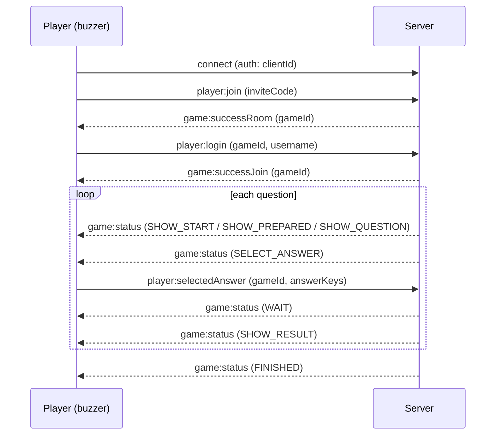
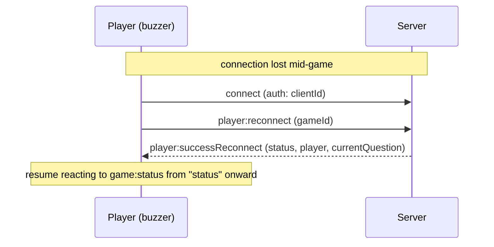

# WebSocket protocol

Razzia's client-server communication runs entirely over [Socket.IO](https://socket.io/), on the `/ws` path. This document describes the **player-facing** part of the protocol, so you can build an alternative client, for example firmware for an ESP32-based physical buzzer for kids, instead of using the web UI.

> This protocol is internal and not version-stabilized. It can change between releases without a deprecation period. Check this file against the version you deploy.

## Connecting

```js
io("http://<host>:<port>", {
  path: "/ws",
  auth: { clientId },
})
```

- `clientId` is a stable, random identifier your device generates once and persists (e.g. in flash on an ESP32). It's what lets a player rejoin their seat in the game after a disconnect (Wi-Fi drop, reboot, etc). Reusing the same `clientId` after a disconnect triggers the reconnect flow instead of creating a new player.
- There's no HTTP auth for players. Anyone who knows a 6-character invite code can join a room, so treat the invite code as a room key.
- The server doesn't override Socket.IO's default keepalive (`pingInterval` 25s / `pingTimeout` 20s). Your client library needs to answer Engine.IO pings within that window or it will be dropped as disconnected.

## Message envelope

Most client -> server events take a plain payload. Events tied to an active game take an object with a `gameId` and, for a few of them, a nested `data`:

```ts
{ gameId: string, data: { ... } }
```

Server -> client game state updates arrive on a single event, `game:status`, shaped as:

```ts
{ name: Status, data: StatusDataMap[Status] }
```

where `name` is one of the status constants below and `data` is the payload for that specific status.

## Joining a game as a player

1. **Check the PIN** (optional, used by the web UI to validate before showing the join form):

   ```
   emit  player:checkPin        <inviteCode: string>
   on    player:checkPinResult  { valid: boolean }
   ```

2. **Enter the room**:

   ```
   emit player:join <inviteCode: string>
   ```

   - `on game:successRoom <gameId: string>`: the invite code is valid and this `clientId` hasn't joined yet. Proceed to step 3.
   - If this `clientId` already joined this game before (e.g. after a reconnect), the server reconnects the player automatically instead and emits `player:successReconnect` (see [Reconnecting](#reconnecting)).
   - `on game:errorMessage <key: string>`: invalid/unknown invite code, or you are the manager's `clientId` trying to join your own game.

3. **Pick a username** (only after receiving `gameId` from step 2):

   ```
   emit player:login { gameId, data: { username } }
   ```

   - `username` must be 1-20 characters ([validators/auth.ts](../packages/common/src/validators/auth.ts)).
   - `on game:successJoin <gameId: string>`: you're in. The server also emits `manager:newPlayer` to the manager and `game:totalPlayers <count>` to everyone in the room.
   - `on game:errorMessage <key: string>`: invalid username, or this `clientId` already has a player in the game.

From here, wait for `game:status` events and react to the `name` field.

## Game status flow

The manager drives the game through a fixed sequence of statuses, broadcast to every player via `game:status`. A single button/buzzer client mainly cares about `SELECT_ANSWER` (when it should accept a button press) and `SHOW_RESULT` (whether that press was correct).

| Status          | Player payload (`data`)                                                                                                   | What it means                                                                                                                                                                                              |
| --------------- | ------------------------------------------------------------------------------------------------------------------------- | ---------------------------------------------------------------------------------------------------------------------------------------------------------------------------------------------------------- |
| `SHOW_START`    | `{ time: number, subject: string }`                                                                                       | Countdown before the quiz starts.                                                                                                                                                                          |
| `SHOW_PREPARED` | `{ totalAnswers: number, questionNumber: number }`                                                                        | "Get ready" screen before a question is shown, tells you how many answer options this question has.                                                                                                        |
| `SHOW_QUESTION` | `{ question: string, media?, cooldown: number }`                                                                          | The question text is shown; answers are **not** accepted yet. `cooldown` is how many seconds until answers open.                                                                                           |
| `SELECT_ANSWER` | `{ question, answers: string[], media?, time: number, totalPlayer: number, questionType: "single" \| "multi", options? }` | Answers are open. `answers.length` tells you how many buttons are relevant (2-4). `time` is the number of seconds to answer. `questionType` is `"single"` (one correct button) or `"multi"` (one or more). |
| `SHOW_RESULT`   | `{ correct: boolean, message: string, points: number, myPoints: number, rank: number, aheadOfMe: string \| null }`        | Whether your submitted answer was correct, points earned, and your new total/rank.                                                                                                                         |
| `WAIT`          | `{ text: string }`                                                                                                        | Generic waiting screen (e.g. after answering, waiting for other players or for the manager to continue).                                                                                                   |
| `FINISHED`      | `{ subject: string, top: Player[], rank?: number }`                                                                       | Game over; final leaderboard.                                                                                                                                                                              |

Other useful events while a game is in progress:

- `on game:updateQuestion { current: number, total: number }`: question index changed.
- `on game:totalPlayers <count: number>`: number of players in the room changed.
- `on game:reset <key: string>`: the session is no longer valid (manager left before start, you were kicked, game expired, etc). Treat this as "go back to the join screen."

## Submitting an answer

Only valid while the current status is `SELECT_ANSWER`, and only the **first** submission per question counts, submitting again is silently ignored:

```
emit player:selectedAnswer { gameId, data: { answerKeys: number[] } }
```

- `answerKeys` are 0-based indices into the `answers` array received in `SELECT_ANSWER`. For a `"single"` question, send a one-element array, e.g. `[1]` for the second button. For `"multi"`, send every button pressed, e.g. `[0, 2]`.
- Points are time-weighted (faster correct answers score higher), computed server-side from `time` and when you answer relative to the start of the answer window.
- After submitting, expect `data: { text: "game:waitingForAnswers" }` on the `WAIT` status, then `SHOW_RESULT` once the question closes (time runs out or every player has answered).

This is the one event a 4-button ESP32 buzzer needs to send: map each physical button to an answer index and emit this event on press, once, while in `SELECT_ANSWER`.

## Reconnecting

If the socket disconnects (`disconnect` event fires implicitly, no action needed client-side) and reconnects, replay the same `clientId` and call:

```
emit player:reconnect { gameId }
```

- `on player:successReconnect { gameId, status, player: { username, points }, currentQuestion }`: you're back in, `status` is the current `game:status` payload so you can resume the UI where it left off.
- `on game:reset <key: string>`: the game no longer exists or this player slot is already connected elsewhere, start over from [Joining a game](#joining-a-game-as-a-player).

You need to persist `gameId` and `clientId` across reconnects/reboots to use this (e.g. in the ESP32's NVS flash) — a fresh `gameId` is only handed out by `game:successRoom` / `game:successJoin` when first joining.

## Leaving a game

An unexpected drop (Wi-Fi loss, reboot) is handled by the server as a temporary disconnect: no event needed, just reconnect later with the same `clientId` as above.

If the player intentionally quits (e.g. a physical "leave" button), emit this instead so the manager sees them go immediately rather than just "disconnected":

```
emit player:leave { gameId }
```

Before the game has started this removes you from the player list entirely; once started, it behaves the same as a disconnect (marked disconnected, seat kept for a potential reconnect).

## Full example

A minimal buzzer runs this sequence once, then just reacts to `game:status` until it sees `SELECT_ANSWER`:



If the socket drops mid-game (Wi-Fi loss, reboot) and comes back, replay the persisted `clientId` and `gameId` instead of joining again:



## Reference: all player-relevant events

Full type definitions live in [packages/common/src/types/game/socket.ts](../packages/common/src/types/game/socket.ts) and the constants (exact string values) in [packages/common/src/constants.ts](../packages/common/src/constants.ts).

**Client → Server**

| Event                   | Payload                                      |
| ----------------------- | -------------------------------------------- |
| `player:checkPin`       | `inviteCode: string`                         |
| `player:join`           | `inviteCode: string`                         |
| `player:login`          | `{ gameId, data: { username: string } }`     |
| `player:reconnect`      | `{ gameId: string }`                         |
| `player:leave`          | `{ gameId: string }`                         |
| `player:selectedAnswer` | `{ gameId, data: { answerKeys: number[] } }` |

**Server → Client**

| Event                     | Payload                                            |
| ------------------------- | -------------------------------------------------- |
| `player:checkPinResult`   | `{ valid: boolean }`                               |
| `player:successReconnect` | `{ gameId, status, player, currentQuestion }`      |
| `game:status`             | `{ name: Status, data }`                           |
| `game:successRoom`        | `gameId: string`                                   |
| `game:successJoin`        | `gameId: string`                                   |
| `game:totalPlayers`       | `count: number`                                    |
| `game:updateQuestion`     | `{ current: number, total: number }`               |
| `game:playerAnswer`       | `count: number` (players who have answered so far) |
| `game:errorMessage`       | `key: string`                                      |
| `game:reset`              | `key: string`                                      |

`key`/`message` string values here are i18n translation keys used by the web UI (e.g. `errors:game.notFound`), not human-readable text — treat them as symbolic error codes and map the ones you care about.

The manager side of the protocol (creating games, starting rounds, kicking players, quiz CRUD) is out of scope for a buzzer client; see [packages/socket/src/handlers](../packages/socket/src/handlers) if you need it.
