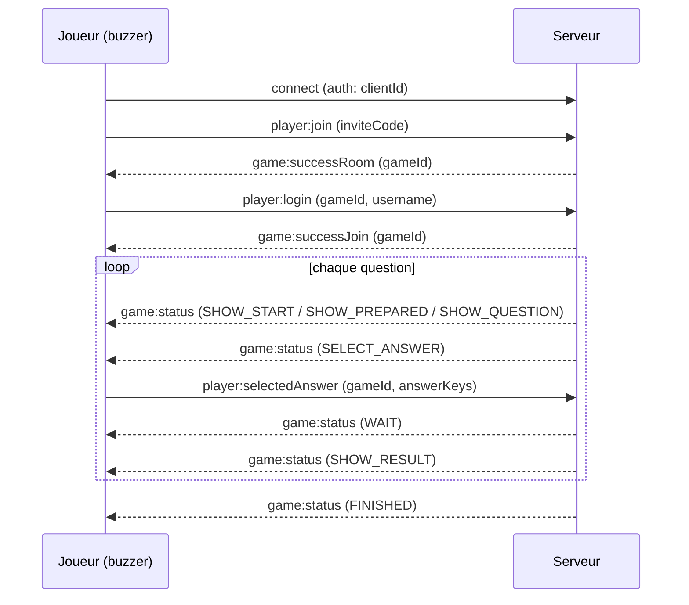
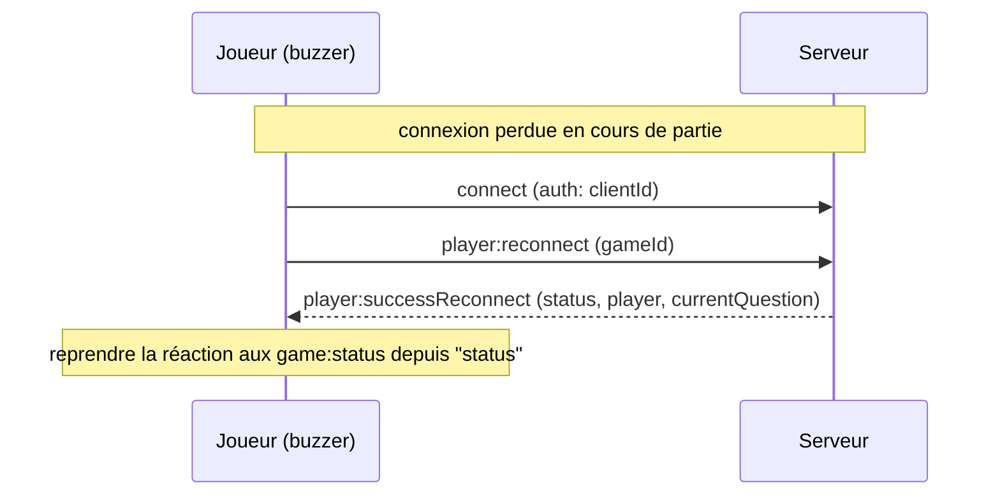

# 🔌 Protocole WebSocket

> 🇬🇧 [English version](websocket-protocol.en.md)

La communication client-serveur de Praxis passe entièrement par [Socket.IO](https://socket.io/), sur le chemin `/ws`. Ce document décrit la partie **côté joueur** du protocole, pour vous permettre de construire un client alternatif — par exemple le firmware d'un buzzer physique à base d'ESP32 — à la place de l'interface web.

> Ce protocole est interne et non stabilisé. Il peut changer entre les versions sans période de dépréciation. Vérifiez ce fichier par rapport à la version que vous déployez.

## Connexion

```js
io("http://<host>:<port>", {
  path: "/ws",
  auth: { clientId },
})
```

- `clientId` est un identifiant stable et aléatoire que votre appareil génère une seule fois et persiste (ex: en flash sur un ESP32). C'est ce qui permet à un joueur de retrouver sa place dans la partie après une déconnexion (coupure Wi-Fi, redémarrage, etc.). Réutiliser le même `clientId` après une déconnexion déclenche le flux de reconnexion plutôt que de créer un nouveau joueur.
- Il n'y a pas d'authentification HTTP pour les joueurs. Quiconque connaît le code d'invitation à 6 caractères peut rejoindre une salle — traitez ce code comme une clé de salle.
- Le serveur ne modifie pas le keepalive par défaut de Socket.IO (`pingInterval` 25s / `pingTimeout` 20s). Votre bibliothèque cliente doit répondre aux pings Engine.IO dans cette fenêtre, sinon elle sera considérée comme déconnectée.

## Enveloppe des messages

La plupart des événements client → serveur prennent un payload simple. Les événements liés à une partie en cours prennent un objet avec un `gameId` et, pour certains, un `data` imbriqué :

```ts
{ gameId: string, data: { ... } }
```

Les mises à jour d'état de jeu serveur → client arrivent sur un seul événement, `game:status`, de la forme :

```ts
{ name: Status, data: StatusDataMap[Status] }
```

où `name` est l'une des constantes de statut ci-dessous et `data` est le payload pour ce statut spécifique.

## Rejoindre une partie en tant que joueur

1. **Vérifier le code PIN** (optionnel, utilisé par l'interface web pour valider avant d'afficher le formulaire) :

   ```
   emit  player:checkPin        <inviteCode: string>
   on    player:checkPinResult  { valid: boolean }
   ```

2. **Entrer dans la salle** :

   ```
   emit player:join <inviteCode: string>
   ```

   - `on game:successRoom <gameId: string>` : le code d'invitation est valide et ce `clientId` n'a pas encore rejoint. Passer à l'étape 3.
   - Si ce `clientId` a déjà rejoint cette partie (ex: après une reconnexion), le serveur reconnecte le joueur automatiquement et émet `player:successReconnect` (voir [Reconnexion](#reconnexion)).
   - `on game:errorMessage <key: string>` : code d'invitation invalide ou inconnu, ou vous êtes le `clientId` du manager qui tente de rejoindre sa propre partie.

3. **Choisir un pseudo** (uniquement après avoir reçu le `gameId` à l'étape 2) :

   ```
   emit player:login { gameId, data: { username } }
   ```

   - `username` doit faire entre 1 et 20 caractères ([validators/auth.ts](../packages/common/src/validators/auth.ts)).
   - `on game:successJoin <gameId: string>` : vous êtes dans la partie. Le serveur émet aussi `manager:newPlayer` au manager et `game:totalPlayers <count>` à tous dans la salle.
   - `on game:errorMessage <key: string>` : pseudo invalide, ou ce `clientId` a déjà un joueur dans la partie.

À partir de là, attendez les événements `game:status` et réagissez au champ `name`.

## Flux des statuts de jeu

Le manager pilote la partie à travers une séquence fixe de statuts, diffusés à chaque joueur via `game:status`. Un client simple (bouton/buzzer) s'intéresse principalement à `SELECT_ANSWER` (quand il doit accepter un appui) et `SHOW_RESULT` (si cet appui était correct).

| Statut          | Payload joueur (`data`)                                                                                                   | Signification                                                                                                                                                                                                       |
| --------------- | ------------------------------------------------------------------------------------------------------------------------- | ------------------------------------------------------------------------------------------------------------------------------------------------------------------------------------------------------------------- |
| `SHOW_START`    | `{ time: number, subject: string }`                                                                                       | Compte à rebours avant le début du quiz.                                                                                                                                                                            |
| `SHOW_PREPARED` | `{ totalAnswers: number, questionNumber: number }`                                                                        | Écran "Préparez-vous" avant l'affichage d'une question — indique combien d'options de réponse cette question comporte.                                                                                              |
| `SHOW_QUESTION` | `{ question: string, media?, cooldown: number }`                                                                          | Le texte de la question est affiché ; les réponses ne sont **pas encore** acceptées. `cooldown` est le nombre de secondes avant l'ouverture des réponses.                                                           |
| `SELECT_ANSWER` | `{ question, answers: string[], media?, time: number, totalPlayer: number, questionType: "single" \| "multi", options? }` | Les réponses sont ouvertes. `answers.length` indique combien de boutons sont pertinents (2-4). `time` est le nombre de secondes pour répondre. `questionType` est `"single"` (un bouton) ou `"multi"` (un ou plus). |
| `SHOW_RESULT`   | `{ correct: boolean, message: string, points: number, myPoints: number, rank: number, aheadOfMe: string \| null }`        | Si la réponse soumise était correcte, les points gagnés et votre nouveau total/classement.                                                                                                                          |
| `WAIT`          | `{ text: string }`                                                                                                        | Écran d'attente générique (ex: après avoir répondu, en attente des autres joueurs ou du manager pour continuer).                                                                                                    |
| `FINISHED`      | `{ subject: string, top: Player[], rank?: number }`                                                                       | Fin de partie ; classement final.                                                                                                                                                                                   |

Autres événements utiles en cours de partie :

- `on game:updateQuestion { current: number, total: number }` : l'index de question a changé.
- `on game:totalPlayers <count: number>` : le nombre de joueurs dans la salle a changé.
- `on game:reset <key: string>` : la session n'est plus valide (le manager a quitté avant le début, vous avez été expulsé, la partie a expiré, etc.). Traitez cela comme "retour à l'écran de connexion".

## Soumettre une réponse

Valide uniquement quand le statut courant est `SELECT_ANSWER`, et seule la **première** soumission par question compte — soumettre à nouveau est ignoré silencieusement :

```
emit player:selectedAnswer { gameId, data: { answerKeys: number[] } }
```

- `answerKeys` sont des indices base 0 dans le tableau `answers` reçu dans `SELECT_ANSWER`. Pour une question `"single"`, envoyez un tableau d'un élément, ex: `[1]` pour le deuxième bouton. Pour `"multi"`, envoyez tous les boutons pressés, ex: `[0, 2]`.
- Les points sont pondérés par le temps (une bonne réponse rapide vaut plus), calculés côté serveur à partir de `time` et du moment où vous répondez par rapport au début de la fenêtre de réponse.
- Après soumission, attendez `data: { text: "game:waitingForAnswers" }` sur le statut `WAIT`, puis `SHOW_RESULT` quand la question se ferme (temps écoulé ou tous les joueurs ont répondu).

C'est l'unique événement qu'un buzzer ESP32 à 4 boutons doit envoyer : associez chaque bouton physique à un index de réponse et émettez cet événement sur appui, une seule fois, pendant `SELECT_ANSWER`.

## Reconnexion

Si le socket se déconnecte (l'événement `disconnect` se déclenche implicitement, aucune action nécessaire côté client) et se reconnecte, réutilisez le même `clientId` et appelez :

```
emit player:reconnect { gameId }
```

- `on player:successReconnect { gameId, status, player: { username, points }, currentQuestion }` : vous êtes de retour, `status` est le payload `game:status` courant pour reprendre l'interface où elle en était.
- `on game:reset <key: string>` : la partie n'existe plus ou ce slot joueur est déjà connecté ailleurs — recommencez depuis [Rejoindre une partie](#rejoindre-une-partie-en-tant-que-joueur).

Vous devez persister `gameId` et `clientId` entre reconnexions/redémarrages (ex: dans le flash NVS de l'ESP32) — un nouveau `gameId` n'est délivré que par `game:successRoom` / `game:successJoin` lors de la première connexion.

## Quitter une partie

Une déconnexion inattendue (coupure Wi-Fi, redémarrage) est traitée par le serveur comme une déconnexion temporaire : aucun événement nécessaire, reconnectez-vous simplement avec le même `clientId`.

Si le joueur quitte intentionnellement (ex: un bouton physique "quitter"), émettez plutôt ceci pour que le manager le voie partir immédiatement plutôt que simplement "déconnecté" :

```
emit player:leave { gameId }
```

Avant le début de la partie, cela vous retire entièrement de la liste des joueurs ; une fois commencée, cela se comporte comme une déconnexion (marqué déconnecté, place conservée pour une éventuelle reconnexion).

## Exemple complet

Un buzzer minimal exécute cette séquence une fois, puis réagit simplement aux `game:status` jusqu'à voir `SELECT_ANSWER` :



Si le socket se déconnecte en cours de partie et revient, réutilisez le `clientId` et le `gameId` persistés plutôt que de rejoindre à nouveau :



## Référence : tous les événements côté joueur

Les définitions de types complètes se trouvent dans [packages/common/src/types/game/socket.ts](../packages/common/src/types/game/socket.ts) et les constantes (valeurs exactes des chaînes) dans [packages/common/src/constants.ts](../packages/common/src/constants.ts).

**Client → Serveur**

| Événement               | Payload                                      |
| ----------------------- | -------------------------------------------- |
| `player:checkPin`       | `inviteCode: string`                         |
| `player:join`           | `inviteCode: string`                         |
| `player:login`          | `{ gameId, data: { username: string } }`     |
| `player:reconnect`      | `{ gameId: string }`                         |
| `player:leave`          | `{ gameId: string }`                         |
| `player:selectedAnswer` | `{ gameId, data: { answerKeys: number[] } }` |

**Serveur → Client**

| Événement                 | Payload                                                   |
| ------------------------- | --------------------------------------------------------- |
| `player:checkPinResult`   | `{ valid: boolean }`                                      |
| `player:successReconnect` | `{ gameId, status, player, currentQuestion }`             |
| `game:status`             | `{ name: Status, data }`                                  |
| `game:successRoom`        | `gameId: string`                                          |
| `game:successJoin`        | `gameId: string`                                          |
| `game:totalPlayers`       | `count: number`                                           |
| `game:updateQuestion`     | `{ current: number, total: number }`                      |
| `game:playerAnswer`       | `count: number` (joueurs ayant répondu jusqu'ici)         |
| `game:errorMessage`       | `key: string`                                             |
| `game:reset`              | `key: string`                                             |

Les valeurs `key`/`message` ici sont des clés de traduction i18n utilisées par l'interface web (ex: `errors:game.notFound`), pas du texte lisible — traitez-les comme des codes d'erreur symboliques et mappez celles qui vous intéressent.

La partie manager du protocole (créer des parties, démarrer des tours, expulser des joueurs, CRUD de quiz) est hors du périmètre d'un client buzzer ; consultez [packages/socket/src/handlers](../packages/socket/src/handlers) si vous en avez besoin.

---

Retour à l'[index de la documentation](README.md).
